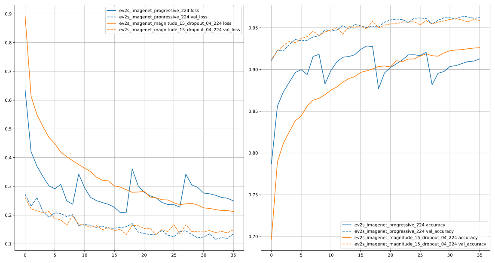

# Table of Contents
<!-- TOC depthFrom:1 depthTo:6 withLinks:1 updateOnSave:1 orderedList:0 -->

- [Table of Contents](#table-of-contents)
- [Basic usage](#basic-usage)
- [Detailed conversion procedure](#detailed-conversion-procedure)
- [Progressive train test on cifar10](#progressive-train-test-on-cifar10)
- [Related Projects](#related-projects)

<!-- /TOC -->
***
# Basic usage
  - My own keras implementation of [Official efficientnetv2](https://github.com/google/automl/tree/master/efficientnetv2). Article [arXiv 2104.00298 EfficientNetV2: Smaller Models and Faster Training](https://arxiv.org/abs/2104.00298) by Mingxing Tan, Quoc V. Le.
  - `h5` model weights converted from official publication.

    | Model           | Finetuned ImageNet1K Top1 Acc. | Params | ImageNet21K weight                                                                                            |
    | --------------- | ------------------------------ | ------ | ------------------------------------------------------------------------------------------------------------- |
    | EfficientNetV2S | 84.9%                          | 21.5M  | [efficientnetv2-s-21k.h5](https://drive.google.com/file/d/1onSbAdvSYuvZzDdEg1rAXs7UIIR-cutB/view?usp=sharing) |
    | EfficientNetV2M | 86.2%                          | 54.1M  | [efficientnetv2-m-21k.h5](https://drive.google.com/file/d/1lXERhhTczTl5RJDJ8JfC6WlZr103MQxp/view?usp=sharing) |
    | EfficientNetV2L | 86.9%                          | 119.5M | [efficientnetv2-l-21k.h5](https://drive.google.com/file/d/1apIx_tNxworcMhWFK384RNdLDCvuQ4o3/view?usp=sharing) |

    | Model       | ImageNet1K Top1 Acc. | Params | ImageNet1K weight                                                                                                   |
    | ----------- | -------------------- | ------ | ------------------------------------------------------------------------------------------------------------------- |
    | EffNetV2-B0 | 78.7%                | 7.1M   | [efficientnetv2-b0-imagenet.h5](https://drive.google.com/file/d/1OfOCQ_iDbRdk4WfN8yS_rZUDz4o62ZdD/view?usp=sharing) |
    | EffNetV2-B1 | 79.8%                | 8.1M   | [efficientnetv2-b1-imagenet.h5](https://drive.google.com/file/d/18lEUbUeLstrEU59XHxDoFTsU-uDGBpTc/view?usp=sharing) |
    | EffNetV2-B2 | 80.5%                | 10.1M  | [efficientnetv2-b2-imagenet.h5](https://drive.google.com/file/d/1ROwAN9kfbGd4n3wm-s3shK9eXNsNOqIC/view?usp=sharing) |
    | EffNetV2-B3 | 82.1%                | 14.4M  | [efficientnetv2-b3-imagenet.h5](https://drive.google.com/file/d/1JTkakRMUp13JNz-5nFcaVOBZoKvCDpHj/view?usp=sharing) |

  - **Usage**
    ```py
    # Load directly
    model = tf.keras.models.load_model('../models/efficientnetv2-s-21k.h5')
    ```
    Or define model and load weights
    ```py
    # model_type is one of ["s", "m", "l", "b0", "b1", "b2", "b3"]
    import efficientnet_v2
    model = efficientnet_v2.EfficientNetV2(model_type="b0", survivals=None, dropout=0.2, classes=1000, classifier_activation=None)
    model.load_weights('../models/efficientnetv2-b0-imagenet.h5')
    ```
    `EfficientNetV2S` / `EfficientNetV2M` / `EfficientNetV2L` are also added just with the relative `model_type`
    ```py
    model = efficientnet_v2.EfficientNetV2S(survivals=None, dropout=1e-6, classes=21843, classifier_activation=None)
    ```
  - **Exclude model top layers**
    ```py
    # Load weights with `by_name=True`
    import efficientnet_v2
    model = efficientnet_v2.EfficientNetV2M(input_shape=(224, 224, 3), survivals=None, dropout=1e-6, classes=0)
    model.load_weights('../models/efficientnetv2-m-21k.h5', by_name=True)
    ```
    Or define a new model from loaded model without head layers
    ```py
    model = tf.keras.models.load_model('efficientnetv2-s-21k.h5')
    # Output layer is `-3` without dropout layer
    model_notop = tf.keras.models.Model(keras_model.inputs[0], keras_model.layers[-4].output)
    model_notop.save('efficientnetv2-s-21k-notop.h5')
    ```
  - **Use dynamic input shape** by set `input_shape=(None, None, 3)`
    ```py
    import efficientnet_v2
    model = efficientnet_v2.EfficientNetV2L(input_shape=(None, None, 3), survivals=None, dropout=1e-6, classes=0)
    model.load_weights('../models/efficientnetv2-l-21k.h5', by_name=True)

    model(np.ones([1, 224, 224, 3])).shape
    # TensorShape([1, 7, 7, 1280])
    model(np.ones([1, 384, 384, 3])).shape
    # TensorShape([1, 12, 12, 1280])
    ```
  - EfficientNetV2-S architecture

    | Stage | Operator               | Stride | #Channels | #Layers |
    | ----- | ---------------------- | ------ | --------- | ------- |
    | 0     | Conv3x3                | 2      | 24        | 1       |
    | 1     | Fused-MBConv1, k3x3    | 1      | 24        | 2       |
    | 2     | Fused-MBConv4, k3x3    | 2      | 48        | 4       |
    | 3     | Fused-MBConv4, k3x3    | 2      | 64        | 4       |
    | 4     | MBConv4, k3x3, SE0.25  | 2      | 128       | 6       |
    | 5     | MBConv6, k3x3, SE0.25  | 1      | 160       | 9       |
    | 6     | MBConv6, k3x3, SE0.25  | 2      | 256       | 15      |
    | 7     | Conv1x1 & Pooling & FC | -      | 1280      | 1       |

  - Progressive training settings for EfficientNetV2
    |              | S min | S max | M min | M max | L min | M max |
    | ------------ | ----- | ----- | ----- | ----- | ----- | ----- |
    | Image Size   | 128   | 300   | 128   | 380   | 128   | 380   |
    | RandAugment  | 5     | 15    | 5     | 20    | 5     | 25    |
    | Mixup alpha  | 0     | 0     | 0     | 0.2   | 0     | 0.4   |
    | Dropout rate | 0.1   | 0.3   | 0.1   | 0.4   | 0.1   | 0.5   |

  - Imagenet training detail
    - RMSProp optimizer with decay 0.9 and momentum 0.9
    - batch norm momentum 0.99; weight decay 1e-5
    - Each model is trained for 350 epochs with total batch size 4096
    - Learning rate is first warmed up from 0 to 0.256, and then decayed by 0.97 every 2.4 epochs
    - We use exponential moving average with 0.9999 decay rate
    - RandAugment (Cubuk et al., 2020)
    - Mixup (Zhang et al., 2018)
    - Dropout (Srivastava et al., 2014)
    - and stochastic depth (Huang et al., 2016) with 0.8 survival probability
# Detailed conversion procedure
  - [convert_effnetv2_model.py](convert_effnetv2_model.py) is a modified version of [the orignal effnetv2_model.py](https://github.com/google/automl/blob/master/efficientnetv2/effnetv2_model.py)
    - Delete some `names`, as they may cause confliction in keras.
    - Use `.call` directly calling `se` modules and other blocks, so they will not be `blocks` in `model.summary()`
    - Just use `Add` layer instead of `utils.drop_connect`, as when `is_training=False`, `utils.drop_connect` functions like `Add`.
    - Add a `num_classes` parameter outside of `mconfig`.
  - Clone repos and download pre-trained models
    ```sh
    .
    ├── automl  # Official repo
    ├── Keras_efficientnet_v2_test  # This one
    ├── models  # Downloaded and extracted models
    ```
  - **Procedure**
    ```py
    import sys
    import tensorflow as tf
    import numpy as np
    from tensorflow import keras

    """ Parameters """
    model_type, dataset = 's', "imagenet21k"
    if dataset == "imagenet21k":
        classes, dropout, load_model_suffix, save_model_suffix = 21843, 1e-6, "-21k", "-21k"
    else:
        classes, dropout, load_model_suffix, save_model_suffix = 1000, 0.2, "", "-imagenet"

    """ Load checkpoints using official defination """
    sys.path.append('automl/efficientnetv2')
    import infer, effnetv2_model
    config = infer.get_config('efficientnetv2-{}'.format(model_type), dataset)
    model = effnetv2_model.EffNetV2Model('efficientnetv2-{}'.format(model_type), config.model)
    len(model(tf.ones([1, 224, 224, 3]), False))
    ckpt = tf.train.latest_checkpoint('models/efficientnetv2-{}{}'.format(model_type, load_model_suffix))
    model.load_weights(ckpt)

    """ Save h5 weights if no error happens """
    model.save_weights('aa.h5')

    """ Reload weights with the modified version """
    sys.path.append("Keras_efficientnet_v2_test")
    import convert_effnetv2_model
    mm = convert_effnetv2_model.EffNetV2Model('efficientnetv2-{}'.format(model_type), num_classes=classes)
    len(mm(tf.ones([1, 224, 224, 3]), False))
    mm.load_weights('aa.h5')

    """ Define a new model using `mm.call`, as mm is a subclassed model, cannot be saved as h5 """
    inputs = keras.Input([224, 224, 3])
    tt = keras.models.Model(inputs, mm.call(inputs, training=False))
    tt.save('bb.h5')  # This is already a converted one.

    """ Reload bb.h5 using full keras defined model """
    import efficientnet_v2
    keras_model = efficientnet_v2.EfficientNetV2(model_type=model_type, survivals=None, dropout=dropout, classes=classes, classifier_activation=None)
    keras_model.load_weights('bb.h5')

    """ Output verification """
    orign_out = model(tf.ones([1, 224, 224, 3]))[0]
    converted_out = keras_model(tf.ones([1, 224, 224, 3]))
    print('Allclose:', np.allclose(orign_out.numpy(), converted_out.numpy()))
    # Allclose: True

    """ Save model and notop version """
    keras_model.save('models/efficientnetv2-{}{}.h5'.format(model_type, save_model_suffix))
    keras.models.Model(keras_model.inputs[0], keras_model.layers[-4].output).save('models/efficientnetv2-{}{}-notop.h5'.format(model_type, save_model_suffix))
    ```
# Progressive train test on cifar10
  - [Colab efficientnetV2_basic_test.ipynb](https://colab.research.google.com/drive/1vmAEfF9tUgK2gkrS5qVftadTyUcX343D?usp=sharing)
  ```py
  # Exclude model top layers first
  model = tf.keras.models.load_model('../models/efficientnetv2-s-21k.h5')
  # Output layer is `-3` without dropout layer
  model_notop = tf.keras.models.Model(model.inputs[0], model.layers[-4].output)
  model_notop.save('../models/efficientnetv2-s-21k-notop.h5')
  ```
  ```py
  from tensorflow import keras
  import progressive_train_test
  import efficientnet_v2

  num_classes = 10
  ev2_s = efficientnet_v2.EfficientNetV2("s", input_shape=(None, None, 3), classes=0)
  ev2_s.load_weights("../models/efficientnetv2-s-21k-notop.h5")
  out = ev2_s.output

  nn = keras.layers.GlobalAveragePooling2D(name="avg_pool")(out)
  nn = keras.layers.Dropout(0.1)(nn)
  nn = keras.layers.Dense(num_classes, activation="softmax", name="predictions", dtype="float32")(nn)
  model = keras.models.Model(ev2_s.inputs[0], nn)

  lr_scheduler = None
  optimizer = "adam"
  loss = "categorical_crossentropy"
  model.compile(loss=loss, optimizer=optimizer, metrics=["accuracy"])

  hhs = progressive_train_test.progressive_with_dropout_randaug(
      model,
      data_name="cifar10",
      lr_scheduler=lr_scheduler,
      total_epochs=36,
      batch_size=64,
      dropout_layer=-2,
      target_shapes=[128, 160, 192, 224], # [128, 185, 242, 300] for final shape (300, 300)
      dropouts=[0.1, 0.2, 0.3, 0.4],
      magnitudes=[5, 8, 12, 15],
  )

  with open("history_ev2s_imagenet_progressive_224.json", "w") as ff:
      json.dump(hhs, ff)
  ```
  
***

# Related Projects
  - [tfa.layers.StochasticDepth](https://www.tensorflow.org/addons/api_docs/python/tfa/layers/StochasticDepth)
  - [Official efficientnetv2](https://github.com/google/automl/tree/master/efficientnetv2)
***
